# Операционные системы UNIX/Linux (Базовый).

  1. [Установка ОС](#part-1-установка-ос)  
  2. [Создание пользователя](#part-2-создание-пользователя)  
  3. [Настройка сети ОС](#part-3-настройка-сети-ос)   
  4. [Обновление ОС](#part-4-обновление-ос)  
  5. [Использование команды  sudo](#part-5-использование-команды-sudo)  
  6. [Установка и настройка службы времени](#part-6-установка-и-настройка-службы-времени)  
  7. [Установка и использование текстовых редакторов](#part-7-установка-и-использование-текстовых-редакторов)  
  8. [Установка и базовая настройка сервиса SSHD](#part-8-установка-и-базовая-настройка-сервиса-sshd)   
  9. [Установка и использование утилит top, htop](#part-9-установка-и-использование-утилит-top-htop)   
  10. [Использование утилиты fdisk](#part-10-использование-утилиты-fdisk)   
  11. [Использование утилиты df](#part-11-использование-утилиты-df)    
  12. [Использование утилиты du](#part-12-использование-утилиты-du)    
  13. [Установка и использование утилиты ncdu](#part-13-установка-и-использование-утилиты-ncdu)    
  14. [Работа с системными журналами](#part-14-работа-с-системными-журналами)     
  15. [Использование планировщика заданий CRON](#part-15-использование-планировщика-заданий-cron)    

## Part 1. Установка ОС

Версия Ubuntu:

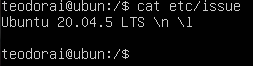
***

## Part 2. Создание пользователя

Добавление пользоватлея test-user

Содержимое файла passwd

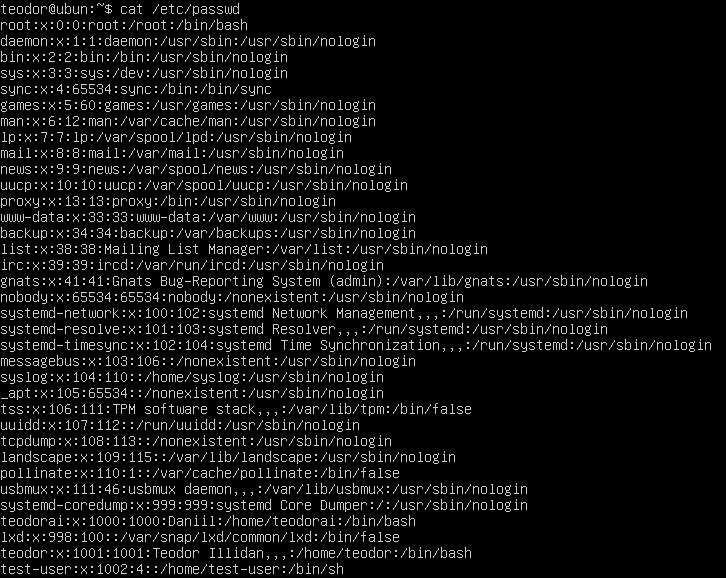

***

## Part 3. Настройка сети ОС

Задаю название машины вида user-1

Устанавливаю временную зону МSK.  

Установка net-tools

Информация о сетевых интерфейсах

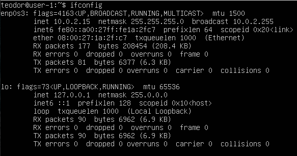
 

>**&nbsp;&nbsp;&nbsp;&nbsp;Loopback (lo) interface** - это виртуальный сетевой интерфейс на компьютере, который используется для тестирования сетевых приложений и для проверки работоспособности сетевых настроек. Он обычно имеет IP-адрес 127.0.0.1 и может использоваться для обращения к компьютеру по сети через этот IP-адрес. Loopback интерфейс не связан с физическими сетевыми интерфейсами, и все данные, отправленные на него, будут получены и обработаны на этом же компьютере.

При выводе информации по интерфейсу enp0s3 от DHCP-сервера, можно получить информацию о ip-адресе машины и default gateway.

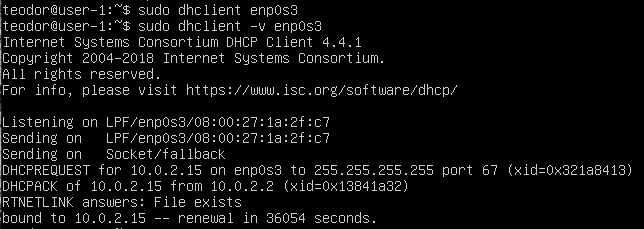
***
 

>**&nbsp;&nbsp;&nbsp;&nbsp;DHCP (Dynamic Host Configuration Protocol)**- это стандартный протокол, который используется для автоматической настройки сетевых параметров компьютеров на сети, таких как IP-адрес, шлюз по умолчанию, маска подсети и DNS-серверы. DHCP серверы автоматически назначают IP-адреса компьютерам при подключении к сети и обеспечивают управление сетевой конфигурацией. Это упрощает настройку компьютеров и снижает количество ошибок, связанных с ручной настройкой сетевых параметров. В целом, DHCP позволяет сетевым администраторам управлять сетью более эффективно и уменьшать время настройки и сопровождения сетевых устройств.

 

Внешний ip-address:

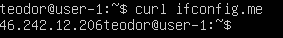

Default-gateway:

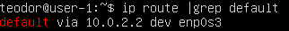

Изменение и применение настроек в файле /etc/netplan/00-installer-config.yaml:

Применение конфигурации и перезагрузка:

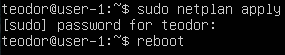

Настройки были применены успешно:

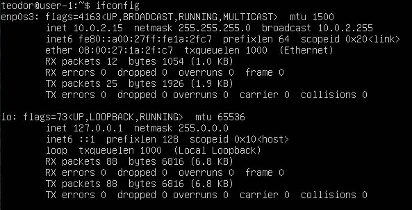

Пинг 1.1.1.1 и ya.ru:

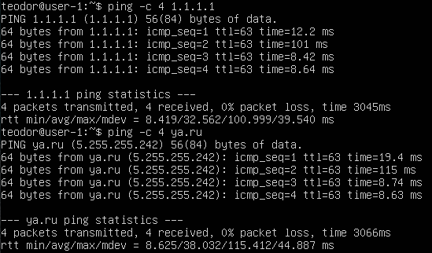

***

## Part 4. Обновление ОС

Все обновления были установлены:

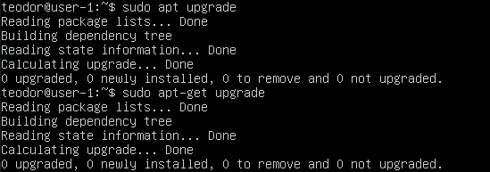

***

## Part 5. Использование команды **sudo**

Было выполнено добавление пользователя test-user к привелигерованной группе, после переключение на test-user, изменение названия машины на ubun:

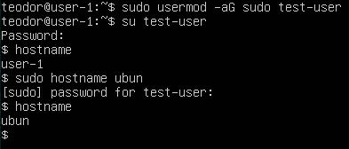

***

## Part 6. Установка и настройка службы времени

Информация о часовом поясе, синхронизации времени и текущем времени:

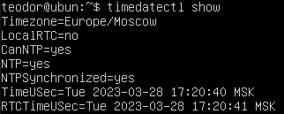

## Part 7. Установка и использование текстовых редакторов 

Установка редакторов:

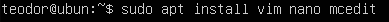

**vim** для сохранения изменений - :wq

**nano** для сохранения изменений - ctrl+o -> enter -> ctrl+x

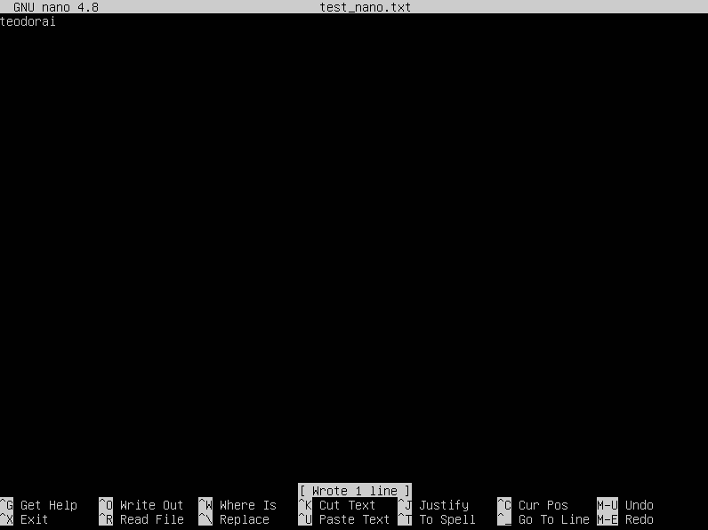

**mcedit** для сохранения изменений - F2 -> enter -> F10

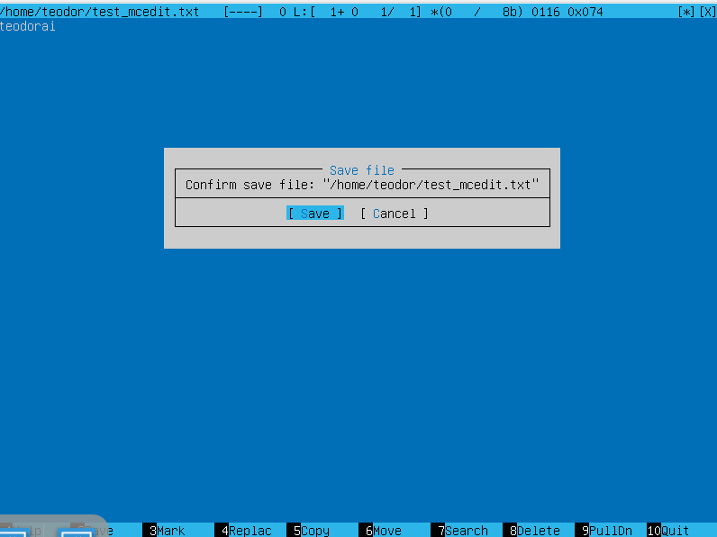

**vim** для выхода без изменений - :wq

**nano** для выхода без изменений - ctrl+x -> n

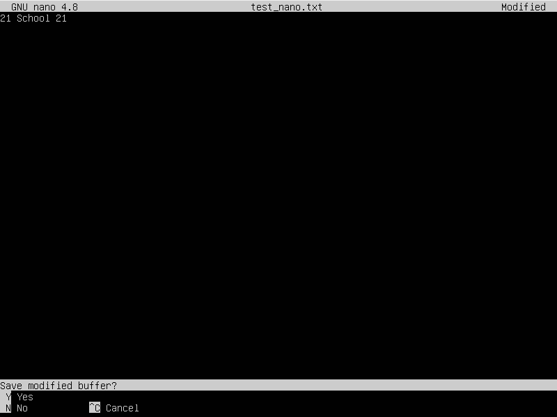

**mcedit** для выхода без изменений - F10 -> No -> enter

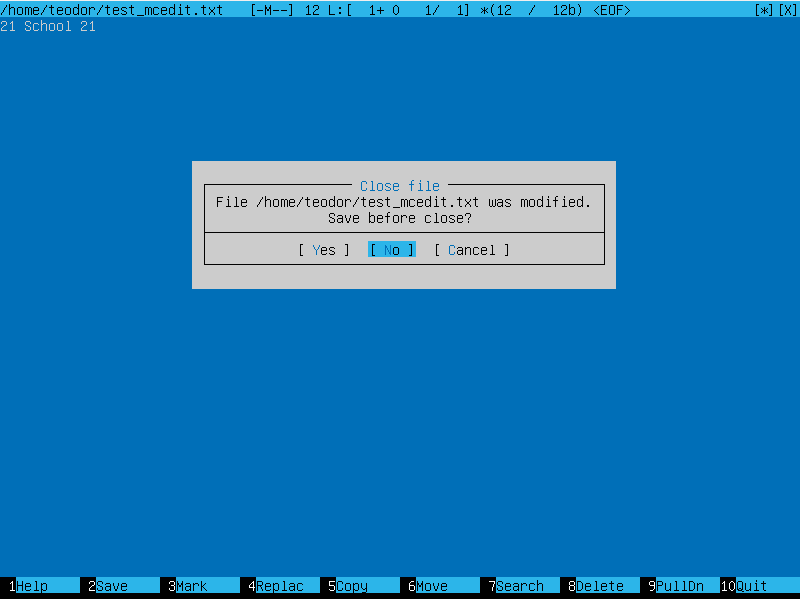

**vim** для поиска - /выражение

**vim** для замены - :s/поиск/на что заменить

**nano** для поиска - ctrl+w -> поиск

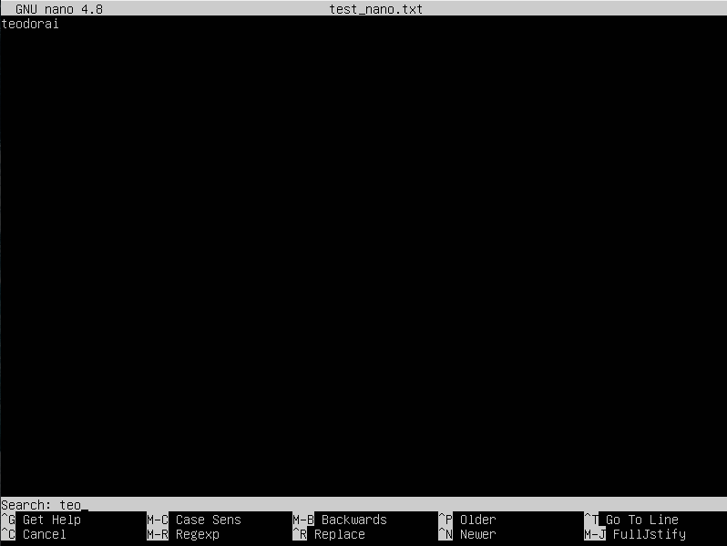

**nano** для замены - ctrl+\ -> поиск -> enter -> на что заменить -> y

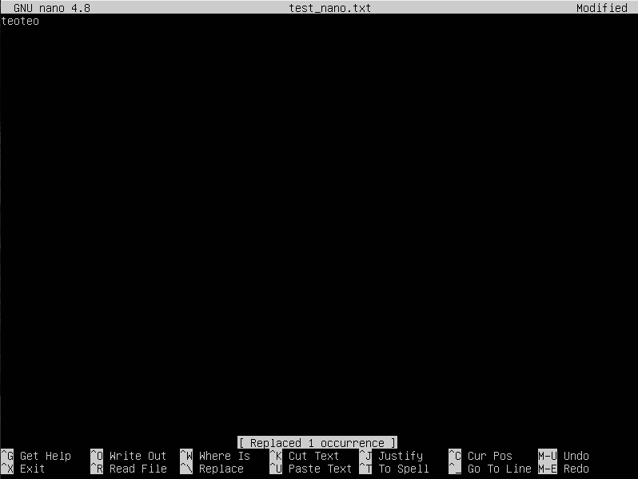

**mcedit** для поиска - F7 -> поиск -> ОК

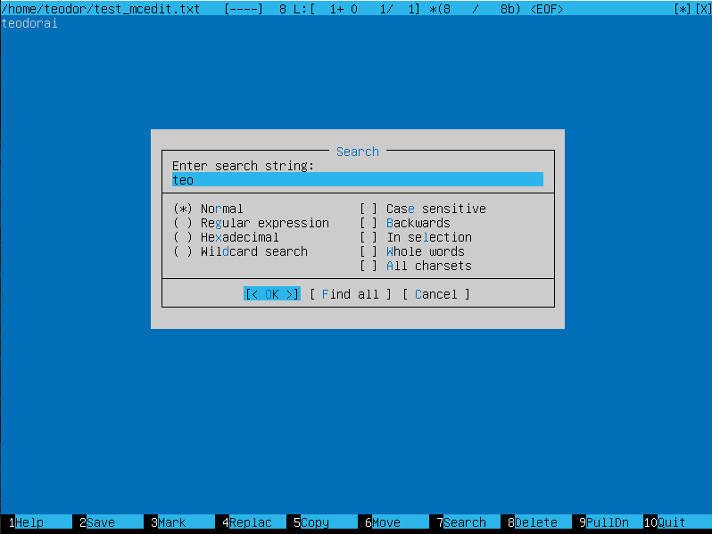

**mcedit** для замены - F4 -> поиск -> на что заменить -> OK -> Replace

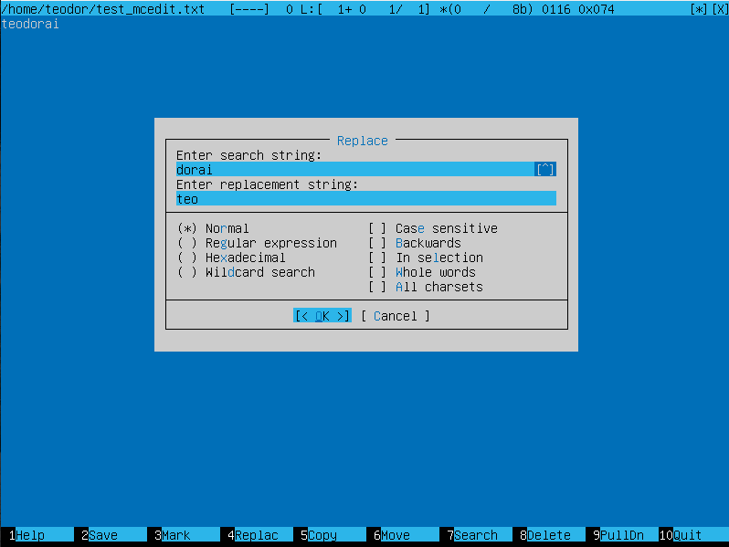

## Part 8. Установка и базовая настройка сервиса **SSHD**

Установил ssh:

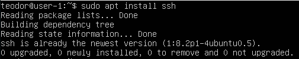

Установил openssh-server:

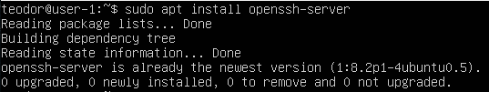

Добавил службу ssh в автостарт при загрузке системы с помощью команды:  

`sudo systemctl enable ssh`

Смотрю состояние службы ssh с помощью команды:  

`systemctl status ssh`

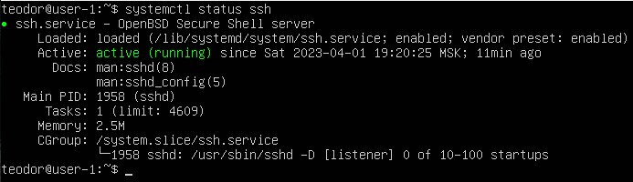

Перенастраиваю порт на 2022 в файле sshd_config:

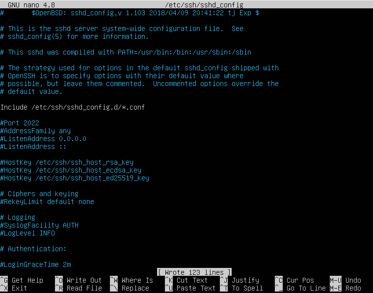

Перезапускаю службу:  

`sudo systemctl restart ssh`

Смотрю наличие ssh с помощью команды:

`ps -A | grep sshd`

и после перезагружаю систему:

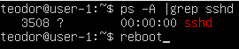

Команда `ps` используется для просмотра текущих процессов в системе. Она имеет множество опций, которые позволяют настроить вывод информации о процессах. Рассмотрим основные опции команды `ps`:

- -A, -e - выбрать все процессы  
- -a - выбрать все процессы, кроме фоновых  
- -d - выбрать все процессы, даже фоновые, кроме процессов сессий
- -N - выбрать все процессы кроме указанных
- -С - выбирать процессы по имени команды 
- -G - выбрать процессы по ID группы 
- -p,  - выбрать процессы PID 
- -s - выбрать процессы по ID сессии 
- -t - выбрать процессы по tty 
- -u - выбрать процессы пользователя 

Вывод команды  

`sudo netstat -tan`

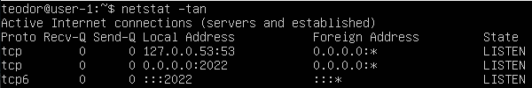

- -t - вывод соединений по протоколу tcp.
- -a - вывод прослушивающих и не прослушивающих сокетов.
- -n - вывод числовых адресов, не пытаясь определить символьное имя узла, порт или имя пользователя.

- Proto - протокол (например: tcp, udp, udpl, raw), используемый сокетом.
- Recv-Q - количество байт, не скопированных пользовательской программой, подключенной к этому сокету. 
- Send-Q - количество байтов, не подтвержденных удаленным узлом. 
- Local Adress - адрес и номер порта локального конца сокета. Если не указана опция -numeric (-n), адрес сокета преобразуется в каноническое имя хоста (FQDN), а номер порта - в соответствующее имя сервиса.
- Foreign Adress - адрес и номер порта удаленного сокета. Аналогично "Локальному адресу". 
- State - cостояние сокета. В данном случае, состояние LISTEN означает, что данный сокет прослушивает входящие соединения.

## Part 9. Установка и использование утилит **top**, **htop**

Вывод команды:  

`top -E k`

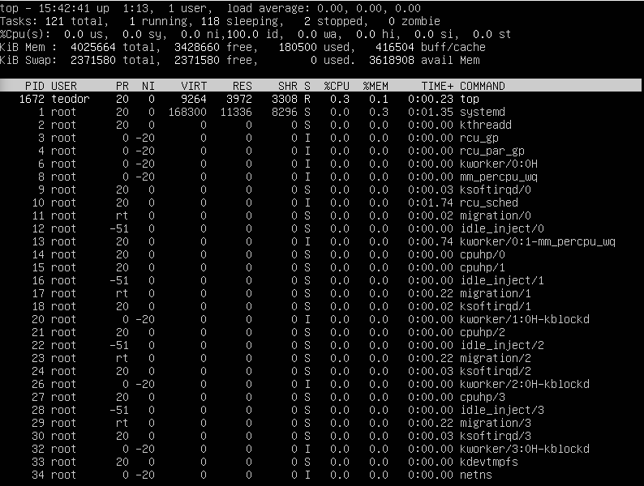

- uptime - 1:13
- количество авторизованных пользователей - 1
- общую загрузку системы - 0.00, 0.00, 0.00
- общее количество процессов - 121
- загрузку cpu - 0.0%
- загрузку памяти - 180.5/4022.7
- pid процесса занимающего больше всего памяти - 1734 (top -o %CPU)
- pid процесса, занимающего больше всего процессорного времени - 724 (top -o %MEM)
 
Сортировка по PID:  

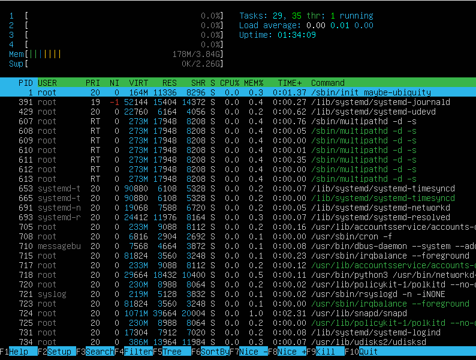

Сортировка по PERCENT_CPU:  

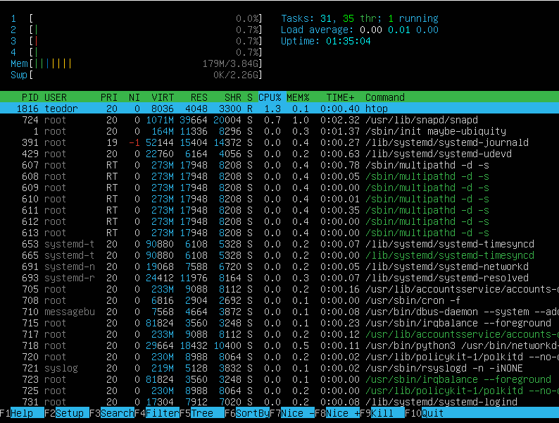

Сортировка по PERCENT_MEM:  

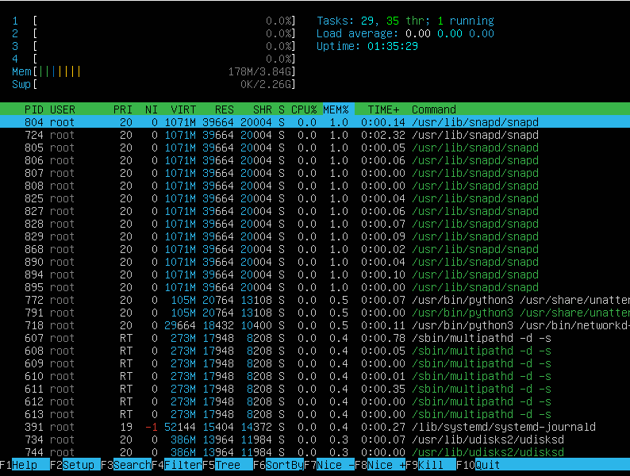

Сортировка по TIME:  

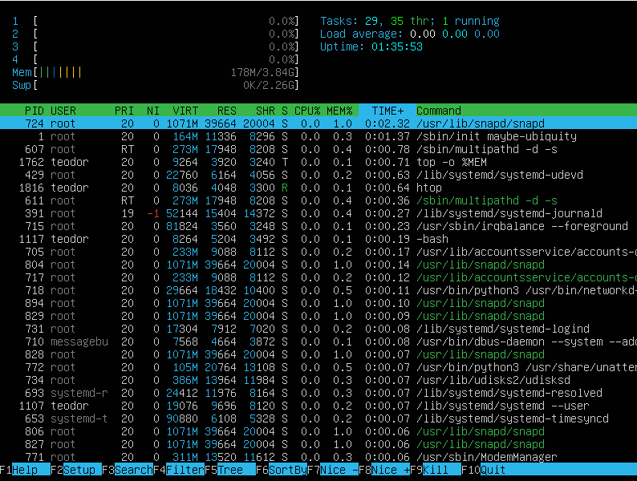

Фильтрация для процесса sshd:  

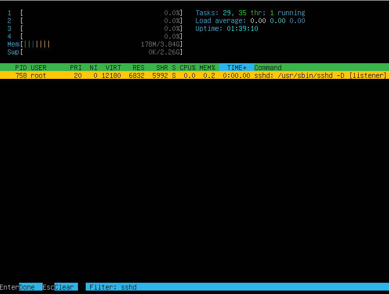

Поиск по имени процесса, а именно по syslog:  

Добавление вывода hostname, clock, uptime:  

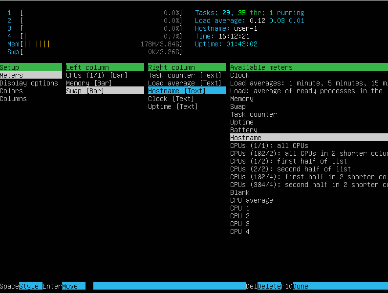

## Part 10. Использование утилиты **fdisk**

Запускаю команду:   

`sudo fdisk -l`

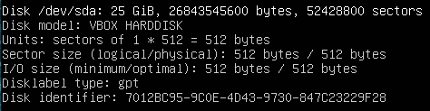

- название жесткого диска - VBOX HARDDISK
- размер - 25 Gb
- количество секторов - 52428800 
- размер swap - отображается в /dev/sda2 - 2Gb

## Part 11. Использование утилиты **df** 

Запускаю команду:   

`df`

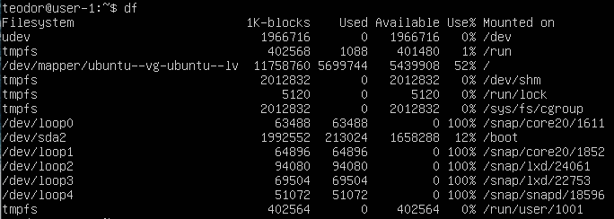

Для корневого раздела (/):
  - размер раздела - 11758760
  - размер занятого пространства - 5699744
  - размер свободного пространства - 5439908
  - процент использования - 52% 
  - единица измерения - килобайт

Запускаю команду:   

`df -Th`

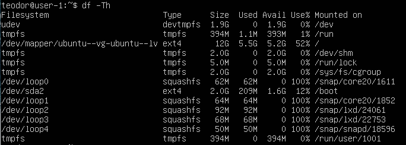

Для корневого раздела(/):
  - размер раздела - 12Gb
  - размер занятого пространства - 5.5Gb
  - размер свободного пространства - 5.2Gb
  - процент использования - 52%
  - тип файловой системы для раздела - ext4.

## Part 12. Использование утилиты **du**

Запускаю команду:   

`du`

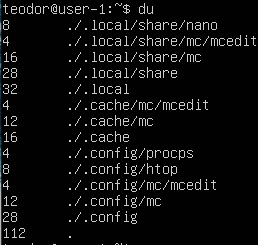

Размер папок в байтах /home, /var, /var/log c помощью команды:   

`sudo du -sb /var/log /var /home`

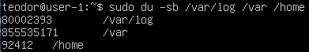

Размер папок в человекочитаемом виде /home, /var, /var/log c помощью команды:   

`sudo du -sh /var/log /var /home`

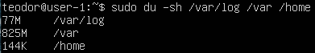

Размер всего содержимого /var/log с помощью команды:   

`sudo du -h /var/log/*`

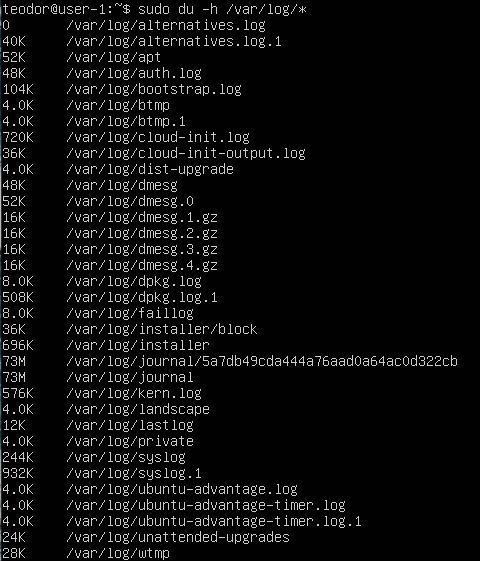

## Part 13. Установка и использование утилиты **ncdu**

Установка ncdu:  

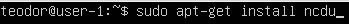

Размер директории /home:  

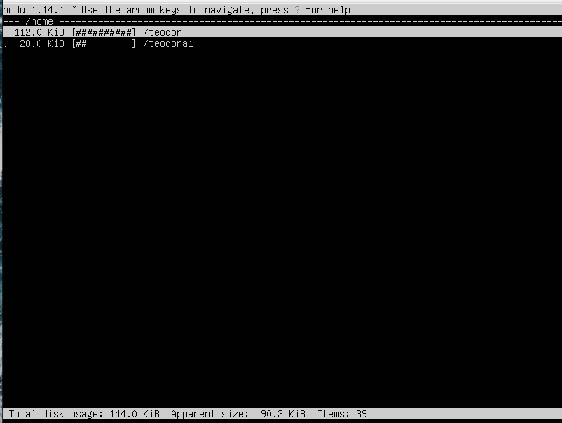

Размер директории /var:  

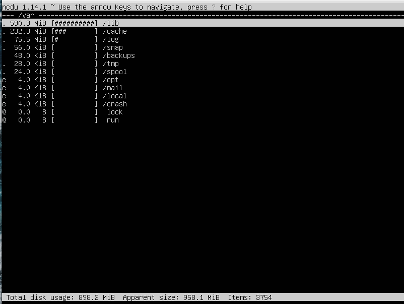

Размер директории /var/log:  

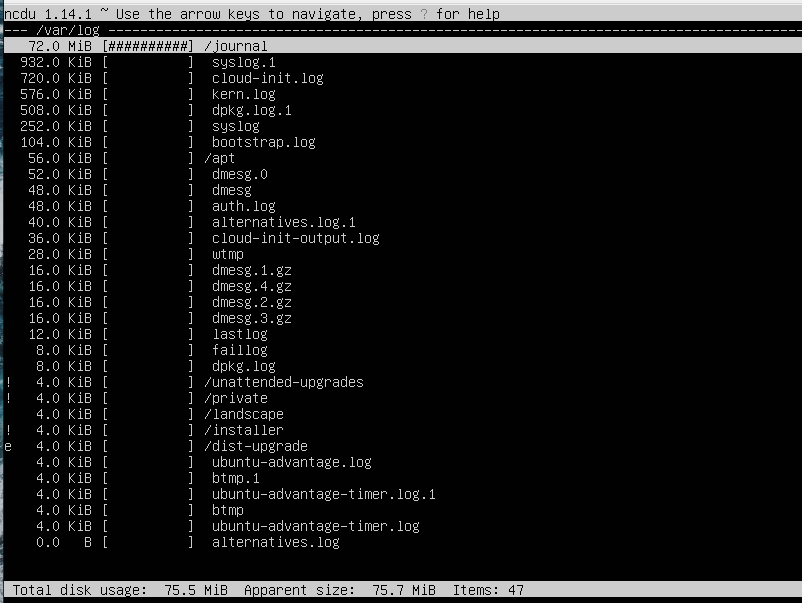

## Part 14. Работа с системными журналами

Просмотрел логи c помощью команд:  

`sudo vim /var/log/dmesg`
`sudo vim /var/log/syslog`
`sudo vim /var/log/auth.log`

Осуществил поиск по файлу auth.log с помощью команды:  

`sudo grep LOGIN /var/log/auth.log`

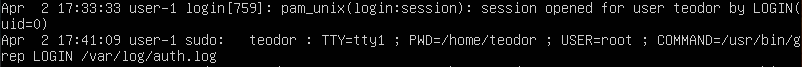

- Время авторизации - 2 Apr 17:33:03
- Имя пользователя - teodor
- Метод входа в систему - LOGIN

Для перезапуска службы SSHd использовал команду:  

`sudo systemctl restart ssh`

Логи о перезапуске службы SSHd в файле /var/log/syslog с помощью команды:  

`sudo tail -20 /var/log/syslog`

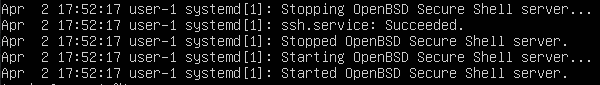

## Part 15. Использование планировщика заданий **CRON**

Создание задания для CRON:  

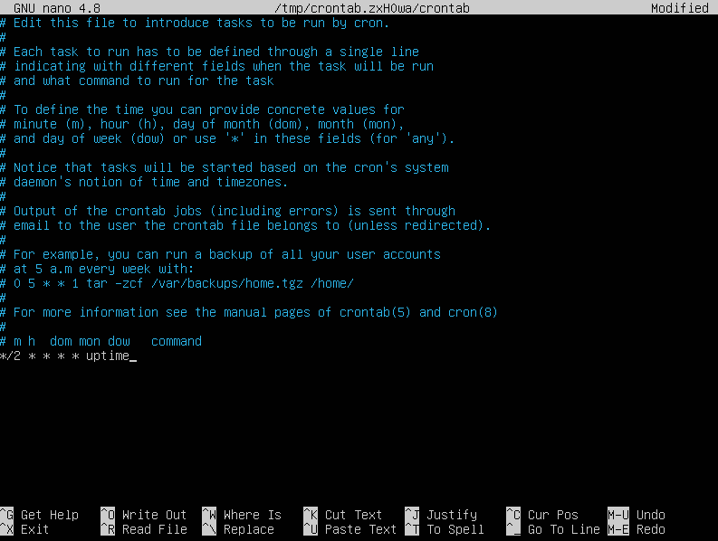

Содержимое логов syslog с запущенным заданием:  

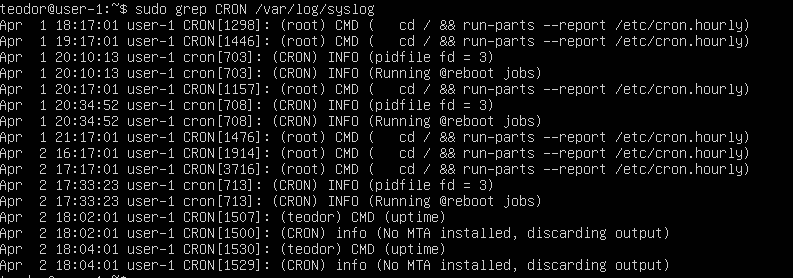

Список задач CRON:  

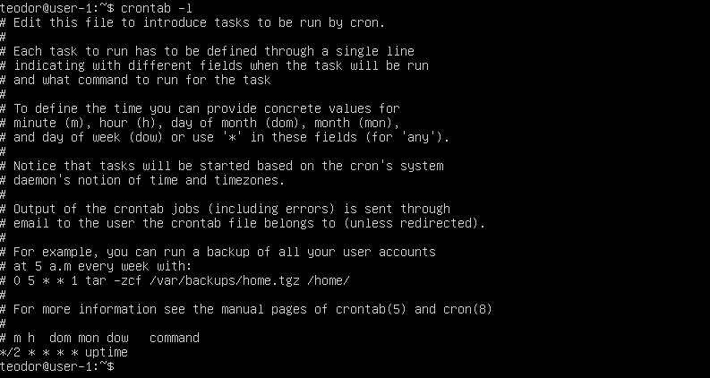

Удаление всех задач:  

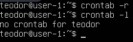